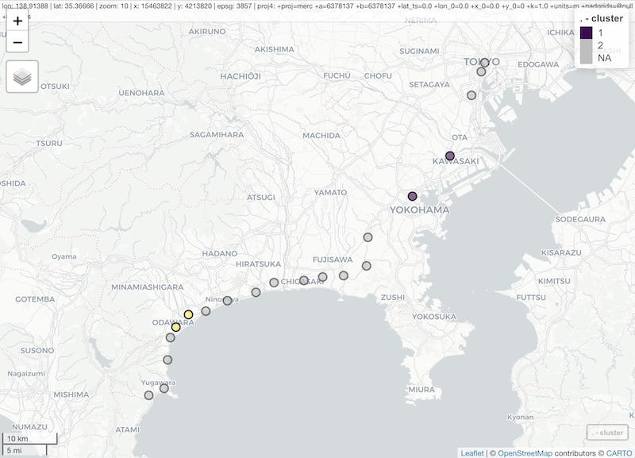

<!-- README.md is generated from README.Rmd. Please edit that file -->

# ssrn

<!-- badges: start -->

[](https://github.com/uribo/ssrn/actions)
[](https://cran.r-project.org/package=ssrn)
[](https://cran.r-project.org/)
<!-- badges: end -->

The goal of **ssrn** is to implement the algorithm provided in “*Scan
for estimating the transmission route of COVID-19 on railway network
using passenger volume*”. It is a generalization of the scan statistic
approach for railway network to identify the hot railway route for
transmitting infectious diseases.

## Installation

You can install the development version of ssrn from GitHub with:

``` r
if (!requireNamespace("remotes"))
  install.packages("remotes")

remotes::install_github("uribo/ssrn")
```

## Example

Below are some of the features of the package, using the built-in
dataset (a section of JR’s Tokaido Line).

``` r
library(ssrn)
library(scanstatistics)
library(dplyr)
data("jreast_jt", package = "ssrn")
```

`jreast_jt` includes the code and names of stations between Tokyo and
Yugawara.

``` r
glimpse(jreast_jt)
#> Rows: 20
#> Columns: 2
#> $ st_code <chr> "00101", "00102", "00103", "00104", "00105", "00106", "00107"…
#> $ st_name <chr> "Tokyo", "Shimbashi", "Shinagawa", "Kawasaki", "Yokohama", "T…
glimpse(jreast_jt_od)
#> Rows: 197
#> Columns: 4
#> $ rw_code           <chr> "001", "001", "001", "001", "001", "001", "001", "0…
#> $ departure_st_code <chr> "00101", "00101", "00101", "00101", "00101", "00101…
#> $ arrive_st_code    <chr> "00102", "00103", "00104", "00105", "00106", "00107…
#> $ volume            <dbl> 950, 1690, 3447, 2387, 542, 459, 271, 377, 597, 859…
```

## Create network window zones

Prepare a matrix object to detect hotspots from spatial relationships on
the railway. This package provides auxiliary functions that create these
matrices based on the data indicating the relationship between stations
(the order of stops) and the passenger volumes.

  - Make an adjacency matrix of stations with `make_adjacency_matrix()`.
  - Create a distance matrix with `make_passenger_matrix()` based on the
    passenger volumes.
  - `network_window()` set the zone from the railway network.

<!-- end list -->

``` r
adj <- 
  make_adjacency_matrix(jreast_jt,
                        st_code, next_st_code)
dist <- 
  jreast_jt_od %>%
  make_passenger_matrix(jreast_jt,
                        departure_st_code,
                        arrive_st_code,
                        st_code,
                        volume)
```

``` r
zones <- 
  network_window(adj, 
                 dist, 
                 type = "connected_B", 
                 cluster_max = 20)
```

``` r
zones
#> [[1]]
#> [1] 1
#> 
#> [[2]]
#> [1] 1 2
#> 
#> [[3]]
#> [1] 1 2 3
#> 
#> [[4]]
#> [1] 1 2 3 4
#> ...
#> [[134]]
#> [1] 20
```

## Estimate hot railway route

Apply the method of spatial scan statistics based on the zone. Here’s an
example of applying dummy data in the
[scanstatistics](https://cran.r-project.org/package=scanstatistics).

``` r
counts <-
  c(2, 2, 1, 5, 7, 1, 
    1, 1, 1, 1, 2, 2, 
    5, 4, 7, 5, 1, 2, 
    1, 1) %>% 
  purrr::set_names(
    jreast_jt$st_name)
counts
#>      Tokyo  Shimbashi  Shinagawa   Kawasaki   Yokohama    Totsuka      Ofuna 
#>          2          2          1          5          7          1          1 
#>   Fujisawa    Tsujido  Chigasaki  Hiratsuka       Oiso   Ninomiya       Kozu 
#>          1          1          1          2          2          5          4 
#> Kamonomiya    Odawara   Hayakawa   Nebukawa   Manazuru   Yugawara 
#>          7          5          1          2          1          1

poisson_result <-
  scan_eb_poisson(counts = counts,
                  zones = zones,
                  baselines = rep(1, 20),
                  n_mcsim = 10000,
                  max_only = FALSE)
```

``` r
top <- top_clusters(poisson_result,
                   zones,
                   k = 2,
                   overlapping = FALSE)
detect_zones <- 
  top$zone %>%
  purrr::map(get_zone, zones = zones) %>%
  purrr::map(function(x) jreast_jt$st_name[x])
df_zones <-
  seq_len(length(detect_zones)) %>%
  purrr::map_df(
    ~ tibble::tibble(
      cluster = .x,
      st_name = detect_zones[.x]
    )
  ) %>%
  tidyr::unnest(cols = st_name)
df_zones
#> # A tibble: 4 x 2
#>   cluster st_name   
#>     <int> <chr>     
#> 1       1 Kawasaki  
#> 2       1 Yokohama  
#> 3       2 Kamonomiya
#> 4       2 Odawara
```


